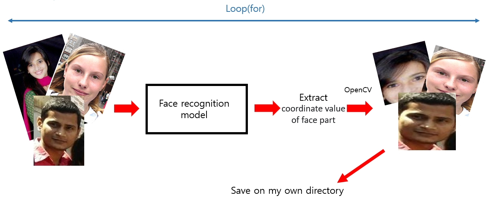

# COVID-19-Face-mask-detector using simple CNN 
## (1) Development environment

* Operating System : Window 10 edu
* Language : Python
* Development Tools : Pycharm Community Edition 2020.2.1
* Library : opencv, tensorflow, keras, pillow, os, ...

## (2) Implementation contents

* It can distinguish whether people are wearing mask or not.

* The results are shown in monitor.

* It can distinguish both black and white mask.

* It is designed not particular lighting environmnet but general lighting environment.

  (The model learned many different lighting environment pictures.)

* The model learned pictures with RGB scale, not gray scale.

## (3) Design methods

### ① Data collection

It seemed hard to collect photo of a face wearing a mask by taking a picture one by one or searching on the internet.

So i used facial landmark to solve the problem.

Using shape_predictor_68_landmark, it can express the part of the face with 68 numbers.

I choose main point number for 3, 8, 13, 29.

3 : Left chin

8 : Lower chin

13 : Right chin

29 : Center of the nose

With the chosen point, I put the mask image on photo of a face.

So i tried to fit the mask on different face size of photoes.

From here, there is a problem with black mask image.

When i used the black mask image which color is (0,0,0) to train model, the model cannot distinguish the real black mask on camera.

Because on camera, there is light reflection on the black mask.

So i lowered the black transparency of the mask image.

and i useed the black mask image below.

As a result, i collected the mask data.

### ② Data Preprocessing

Also i collected face images which are not wearing mask.

But what the model really need is only the face part not the body part. 

To extract the face part, i used face recognition model.

### ③ Machine learning

I designed neural network using CNN.

#### Visual graph

### ④ Test

I prepared the test data which does not overlap with train data.

### ⑤ Result

## (4) Code description

* Create_Mask_Dataset .py : Code to put the mask image into the face image

* Face_Dataset_Save .py : Code to save the only face part images in particular directory 

* Data_Deeplearning .py : Neural network code designed in CNN

* Model_Test .py : Code to test the model

* mainvideo .py : main code (if you want to test the model, you just run this code.) 

* 8LBMI2.h5 : trained model

## Reference

[Face dataset 1](https://github.com/prajnasb/observations)

[Face dataset 2](https://generated.photos/faces)

